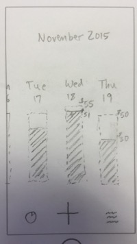
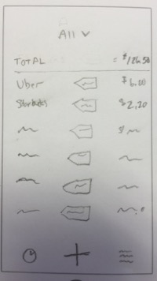
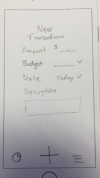

# Per Diem

A daily finance tracking app. Per Diem helps you budget your spending based on time and spending goals. Set a goal for how much you'd like to spend in a given time period, then enter each transaction you make or future estimated transactions. Per Diem will tell you at a glance how much you can spend safely each day (based on the total budget, how much you've already spent, days remaining in timeframe, and any future transactions).

## User Stories

**Required**

As a user...

*italics* items are not completely finished.
- [x] I can login using touch ID *(partially done)*
- [x] I can input, *edit*, and delete transactions (past and future) in *my local currency*.
- [x] I can view the amount spent within the timeframe and *daily "Per Diem" amount*. (also for each budget).
    - [ ] Per Diem = (budget - (spent + futures)) / remaining days
- [x] I can view all previous transactions and *sort/filter by category, date, payee, payment method, or timeframe*. *Can view totals of selected transactions*.
- [ ] I can view, create, edit, and *delete categories. *May not be end up being needed.*
- [x] I can view, create, *edit, and delete* budgets based on a category or *multiple categories and a timeframe*.
- [ ] I can specify savings and spending goals. *May not end up being necessary. Wil likely just be part of the budgets*
- [ ] *I can confirm, edit, or delete ‘future’ transactions if their date is today or in the past.*

Milestone 1 Walkthrough (Required Stories)  

**Optionals**
As a user…
- [ ] I can invite others to my ‘organization’ or budgets.
- [ ] I can get push notifications if any ‘future’ transactions are not confirmed or deleted (based on time of day).
- [ ] I can get push notifications for transactions entered/edited by other members of my group.
- [ ] I can set a budget but also a target spending limit/range. If I exceed the limit, I get a warning push notification. If I stay under, I get a positive message congratulating me.
- [ ] I can save my current location with transaction data.
- [ ] I can use my current location to get possible merchant suggestions from Yelp or Foursquare.
- [ ] I can use the camera to save a picture of the receipt.
- [ ] I can use the camera and OCR to extract the transaction details.
- [ ] I can add comments to transactions (chat back and forth) with other group members.
- [ ] I can enter a transaction from the "today" lock screen widget.
- [ ] I can enter a transaction using Siri. (not sure if Siri allows this other than dictation).
- [ ] I can create an account and edit my details

## [Mock app](https://popapp.in/w/projects/564e42c4ceac464d0cbc65a3/preview) & Wireframes:
    
  

## Data Model Entities and properties
We're still defining how we will persist data (Rails api, Sparse, icloud).

**Transaction**
* amount
* category_id
* user_id
* budget_id
* debit / credit (default to debit) (income/expense)
* timestamp - default to now
* tags - can be smart over time and "learn" based on location / amount / time of day
* payment_type_id (credit card / check / cash / transfer)
* repeat pattern (daily / weekly / biweekly / monthly / custom - see google calendar events for pattern) - default: null

**Category**
* name
* (parent category)
* ???

**Budget**
* Max Amount
* Category/categories
* Time-frame

**Group / Organization**
Maybe not needed. We might link / share budgets using a unique code or bluetooth proximity.

* Name
* Members
* Budgets
* Categories
* Transactions

**Payment Types**
* Credit
* Debit
* Cash
* Transfer
* (user input - specific card names, etc)

**Users** (maybe not needed - identify by device)
* First name
* Last name
* Email
* Username
* Password
* organization_ids
